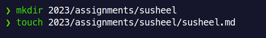

# Assignments

## Tasks One

1. Create **fork** of of [First Contribution](https://github.com/ITClubPulchowk/First-Contribution) repository.

   **Forking the repository**:

   

   **Create Fork Screen**:

   

2. Clone the _fork_ repository.

   _Note: You have open the forked repository_

   **Copy SSH link**:

   

   **Cloning the forked repository**:

   

3. Open _cloned repository_ in **Visual Studio Code**

   _Note: `cd` command is used to change the directory_

   

4. Create a branch for `<your_name>` from `2023` branch

   

5. Creating assignments files and folder

   - Create `<your_name>` folder inside `2023/assignments` folder
   - Crrate `<your_name>.md` file inside the folder that you have created above

   

6. Writing the assignments

   [writing_assigments.webm](https://github.com/ITClubPulchowk/First-Contribution/assets/83917129/0b86fe15-5649-4e61-8f1f-2996a6882a62)

   What is done in video?

   - Copies the content of [`sample.md`](./assignments/sample.md) to `2023/assignments/<your_name>/<your_name>.md`.
   - Replace the `<your_name>` in the file with your name.
   - Below down, you will find some the outline how to write the commands that we have learned.

     ```markdown
     1.  `command`

         Description:

            .............

         Examples:

            .............
     ```

   - Remove the `git init` and `git add` and ***write the command you have learned***.

7. `add` and `commit`, `<your_name>.md` file that you have created.

   

## Tasks Two

1. Head over to [Learn Git Branching](https://learngitbranching.js.org/?NODEMO) website

2. Try to create the following image with the help of command that we have learned in Git Workshop

   

3. Take the screenshot of what you have done in [Learn Git Branching](https://learngitbranching.js.org/?NODEMO) website.

4. Rename the screenshot to `<your_name>.png` and keep that files inside `2023/assignments/susheel/`

   _Your folder structure will look like below_

   

5. `add` and `commit` `<your_name>.png` file

   

## Submission

1. Push the commit to your remote repository using `git push -u origin <your_name_branch>`

   

2. Open pull request from `<your_name>` branch of **forked repository** to `2023` branch of **orginal repository**.

   **Compare and Pull Request button**

   

   **Create Pull Request**

   